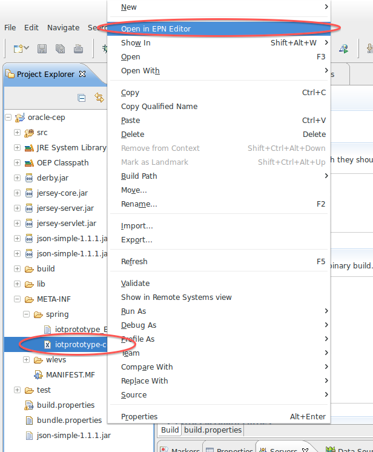

# Block 11


**Um die EPN Ansicht zu öffnen:**


* CQL kann hat keinen Modulo Operator. %10 muss also mit Multiplikation, Division und Subtraktion gelöst werden.
* Es hilft erst die JavaKlassen zu schreiben und diese dann im EPN beim Hinzufügendialog auszuwählen. Adapter & Bean (speziell die notwendigen `implements ...` ) können im HelloWorld Projekt abgeguckt werden

**REST Request an URL z.B. so (mit Java Bordmitteln):**

```java
/* Takes a JSON String and sends it to the URL using the specified HTTP Method*/
public String sendJSON(String urlString, String payload, String httpMethod) {

		String line;
		StringBuffer jsonString = new StringBuffer();
		try {

			URL url = new URL(urlString);
			HttpURLConnection connection = (HttpURLConnection) url.openConnection();

			connection.setDoInput(true);
			connection.setDoOutput(true);
			connection.setRequestMethod(httpMethod);
			connection.setRequestProperty("Accept", "application/json");
			connection.setRequestProperty("Content-Type","application/json; charset=UTF-8");
			
			OutputStreamWriter writer = new OutputStreamWriter(
					connection.getOutputStream(), "UTF-8");
			writer.write(payload);
			writer.close();
			BufferedReader br = new BufferedReader(new InputStreamReader(
					connection.getInputStream()));
			while ((line = br.readLine()) != null) {
				jsonString.append(line);
			}
			br.close();
			connection.disconnect();
		} catch (Exception e) {
			e.printStackTrace();
		}
		
		//TODO just for debugging
		System.out.println(jsonString.toString());
		return jsonString.toString();
	}
```