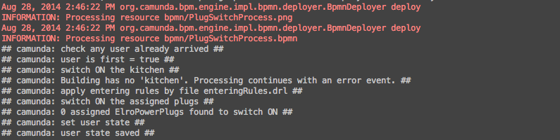

# Block 9

**Aufgabe**: Integriere Camunda in die Spring Applikation und starte den Prozess aus dem Controller statt den Service aufzurufen

*Ist in der hibernate.properties `create` oder `validate`? Create droppt bei jedem Start alle Tabellen und erstellt sie neu. *

*Beachte die weiteren Controller. Diese stellen die CRUD Operationen via REST bereit, sodass diese von der Mobile Applikation aus aufgerufen werden können*

1. Integriere die Camunda Prozessengine in die Spring Applikation
	1. Füge die notwendige Konfiguration in die `mvc-dispater-servlet.xml` Datei ein.
	2. Starte die Applikation, prüfe im Log ob die Camunda Engine hoch gefahren ist
2. Füge den BPMN Prozess zur Applikation hinzu und starte diesen vom Controller aus
	1. Erstelle eine`META-INF/processes.xml` Datei in `src/main/resources` vom `rest-camunda` Modul
	2. Füge den  `plug-switch-process` zum Prozessarchiv hinzu
	3. Modifiziere den `UserController` code, sodass dieser den Prozess anstößt
	4. Regestriere alle delegates als beans mit der spring applikation
	4. Starte die Applikation neu und prüfe ob beim aufrufen der User State Change Methode der Camunda Prozess durchläuft

3. Look at the process .png image in the ressources folder

**Dies ist zu erwarten:**
